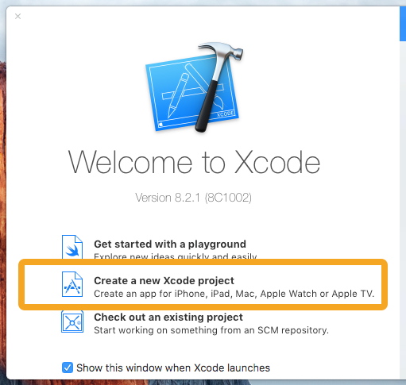
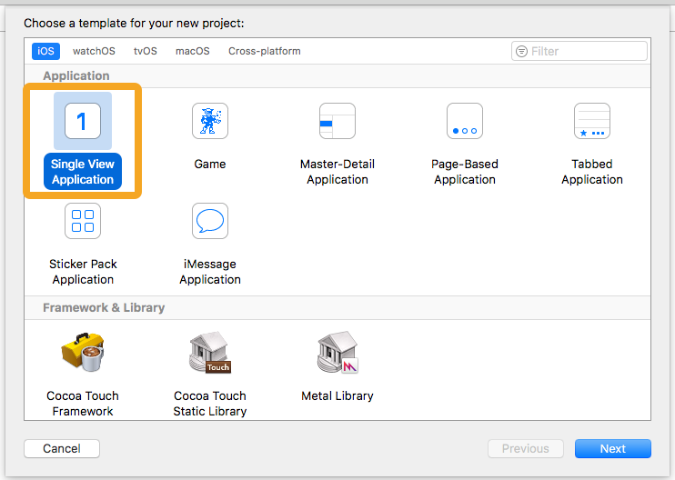
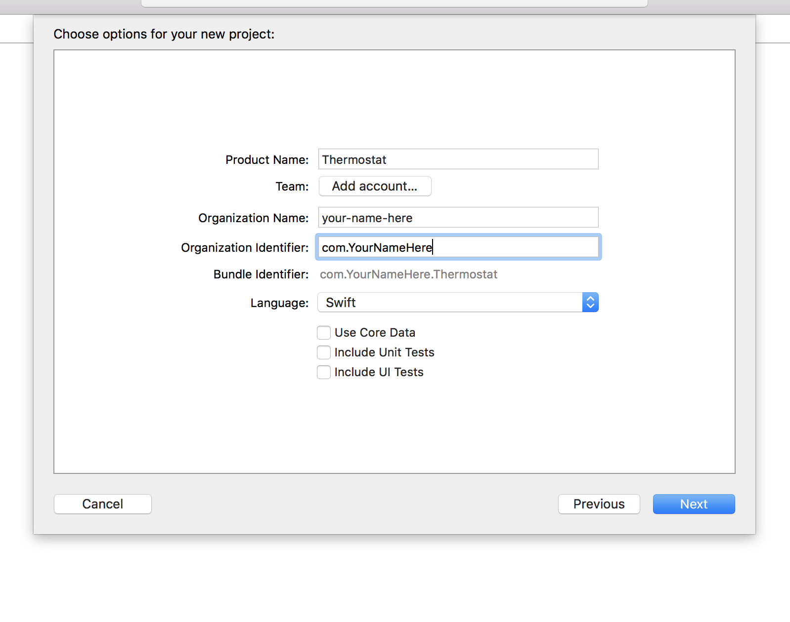

# ios-thermostat-app

### Pre-requisites

In order to do iOS development, you will need a Mac.

Download and install Xcode from the App Store. This may take a while — its a big program.

### Creating a Project

##### 1. Open Xcode and click **Create a new Xcode project**.

  

##### 2. Select Single View Application from the **iOS > Application list**, and click **Next**

  

##### 3. Fill in the project details:

  * Product Name: Clicker
  * Team: None
  * Organization Name: Whatever you want — your name is always a good fill-in
  * Organization Identifier: com.(OrganizationName)

  Make sure Swift is selected as the language, and Devices is set to Universal.

  Untick the 3 boxes at the bottom.

  Click Next

  

##### 4. Select a sensible place to save your project, then hit **Create**.

  Take some time to look around the project that's been created with your coach. What files are there? How do you run your app?

##### 5. Add a label for the title

  - we're going to search for a label in the object library and drag to the view controller scene
  - Then double-click on the label and you should be able to edit it's content and give it an initial text
  - Then you can make the larger to give the text some space

  

  - With the label still selected Go to the attributes inspector and center align it
  - Under the label's attributes go click on Font and set it to 26, then set the style to Bold

##### 6. Add a label for the initial temperature

  - Increase it's size, set the text, center align it
